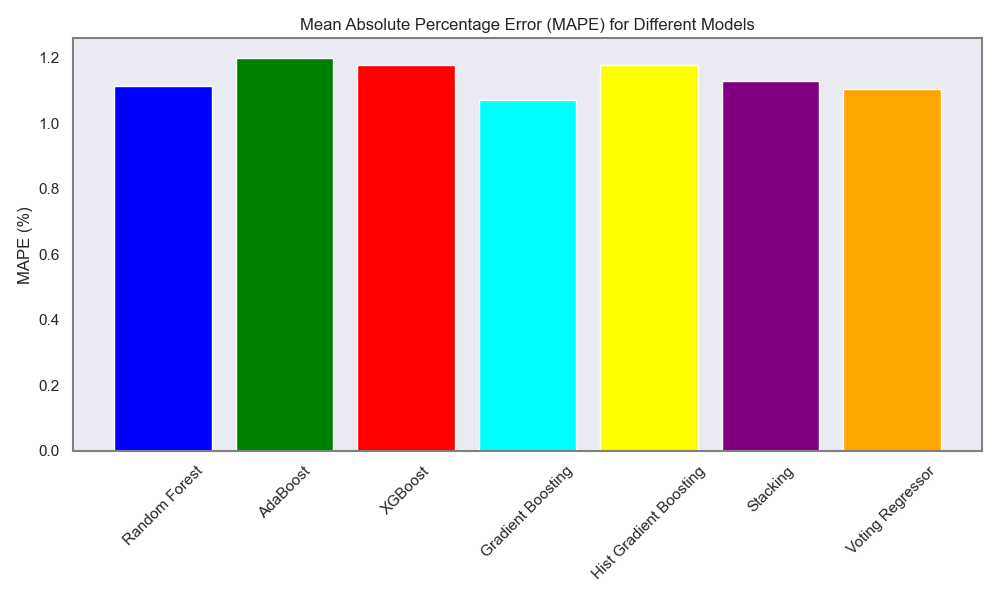

# Ensembles-in-Machine-Learning

## Overview

This project addresses the challenging task of cryptocurrency price prediction, focusing specifically on Bitcoin (BTC-USD) price forecasting. In financial markets characterized by high volatility and non-linear patterns, traditional forecasting methods often fall short of providing accurate predictions.

Ensemble learning methods offer a powerful solution to this problem by combining multiple machine learning models to achieve better predictive performance than any individual model could accomplish alone. By leveraging the collective intelligence of various algorithms, we can capture different aspects of the complex price patterns in cryptocurrency markets.

This project implements and compares several state-of-the-art ensemble methods:

1. **Random Forest** - A bagging-based ensemble that builds multiple decision trees and merges their predictions
2. **AdaBoost** - A boosting algorithm that sequentially builds models by focusing on previously misclassified instances
3. **XGBoost** - An optimized gradient boosting framework known for its speed and performance

4. **Gradient Boosting** - Gradient boosting Regression calculates the difference between the current prediction and the known correct target value. This difference is called residual. After that Gradient boosting Regression trains a weak model that maps features to that residual
5. **Histogram Gradient Boosting**- HistGradientBoosting accelerates gradient boosting by binning continuous features into histograms, reducing split evaluations. This lowers memory and computation costs, making it efficient for large datasets. It builds trees sequentially, each correcting prior errors. Supported in scikit-learn, it handles missing values natively and rivals XGBoost and LightGBM in performance.

6. **LightGBM**- LightGBM is a fast, efficient gradient boosting framework by Microsoft, optimized for large datasets. It uses histogram-based algorithms and leaf-wise tree growth to reduce memory and training time, while maintaining high accuracy. Widely used in machine learning competitions and production systems for classification, regression, and ranking tasks.

7. **Stacking** - A meta-learning approach that uses predictions from multiple models as inputs to a final model

8. **Voting** - A simple but effective method that combines predictions through weighted or unweighted averaging

The implementation includes rigorous hyperparameter tuning, feature importance analysis, and model evaluation using appropriate metrics like Mean Absolute Percentage Error (MAPE). By visualizing ensemble architectures and comparing model performance, this project provides both educational value about ensemble methods and practical utility for cryptocurrency price prediction.

Beyond the predictive models themselves, this repository serves as a comprehensive tutorial on implementing ensemble learning techniques in Python, with visualizations that explain the core concepts behind different ensemble approaches.

## 📁 Project Structure
the streamlit app for this project can be seen in `Streamlit_app` folder
```
Ensembles-in-Machine-Learning/
├── streamlit_app/
│    ├── main.py
│    │
│    ├── pages/
│    │      ├── 01_models_visualization.py        # Visualization page for ensemble learning concepts
│    │      │                                 # Creates network diagrams to explain different ensemble methods
│    │      │
│    │      └── 02_Bitcoin_Prediction.py        # Main page for Bitcoin price prediction using ensemble models
│    │                                   # Implements data fetching, preprocessing, model training and evaluation
│    ├── Scripts/
│    │      ├── ensembles.py       # Functions related to ensemble models
│    │      │
│    │      └── visualization.py    #Functions Related to plotting results and graphs
│    │
│    └── README.md                           # Project documentation and overview   │
│
│
├── requirements.txt                    # List of Python package dependencies with versions
│                                       # Includes scikit-learn, xgboost, yfinance, matplotlib, etc.
│
└── .gitignore                          # Specifies files and directories to ignore in git versioning
                                       # Excludes venv/, __pycache__/, output/, and other generated files


```

## Results



For detailed instructions please refer to the [Instructions](./Instructions.md) file.
